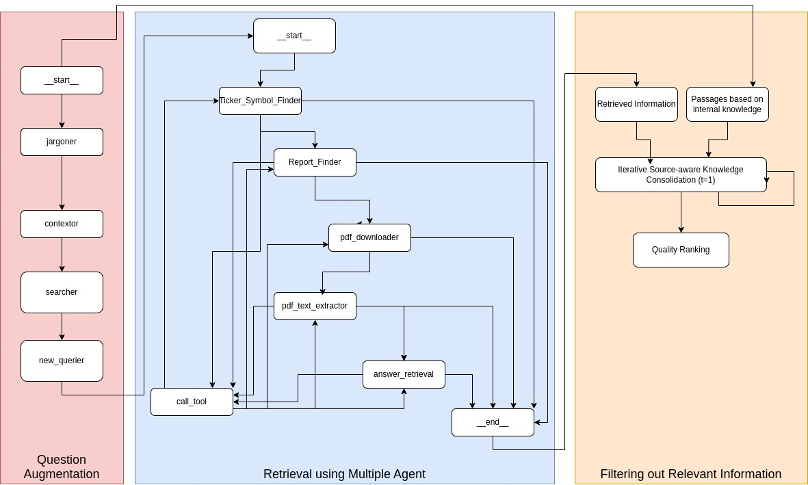

# Agentic RAG with Pathway: HP3

## Proposed Approach
<p align="center">
  
</p>

## Table of Contents
- Introduction
- Installation
  - Backend
  - Frontend
- Usage
- [Codebase Overview](#codebase-overview)
  - Backend
  - Frontend
- Features
- Contributing
- License

## Introduction
HP3 is a web application that provides a chat interface for users to interact with an AI assistant. The assistant can process user queries, retrieve documents, and handle file uploads. The backend is built with Flask and Socket.IO, while the frontend is built with React and Socket.IO-client.

## Code Structure

```
.
├── Additional_files
│   ├── Query_Augmentation_Tool.ipynb
|   ├── Annual_Report_Reader_upload.ipynb
│   ├── AstuteRAG_upload.ipynb
│   ├── MultiAgent_QueryAnswering.ipynb
│   └── PATHWAY_VectorStore.ipynb
├── backend
│   ├── agents.py
│   ├── llm.py
│   ├── main.py
│   ├── online_data_process.py
│   ├── requirements.txt
│   ├── tools.py
│   ├── uploads
│   │   └── Financial Case Study.pdf
│   └── workflow.py
├── frontend
│   ├── craco.config.js
│   ├── package.json
│   ├── package-lock.json
│   ├── public
│   │   ├── favicon.ico
│   │   ├── index.html
│   │   ├── logo192.png
│   │   ├── logo512.png
│   │   ├── manifest.json
│   │   └── robots.txt
│   ├── src
│   │   ├── App.css
│   │   ├── App.js
│   │   ├── App.test.js
│   │   ├── components
│   │   │   ├── Drawer.jsx
│   │   │   └── NavBar.jsx
│   │   ├── index.css
│   │   ├── index.js
│   │   ├── logo.svg
│   │   ├── pages
│   │   │   ├── chatInterface.jsx
│   │   │   ├── Error.jsx
│   │   │   └── Home.jsx
│   │   ├── reportWebVitals.js
│   │   ├── setupTests.js
│   │   └── utils
│   │       ├── Animation - 1709406018252.json
│   │       ├── RenderMarkdown.js
│   │       └── speech_recognition.js
│   └── tailwind.config.js
├── images
│   └── Aproach.jpeg
└── README.md

```

## Installation

### Backend
1. Navigate to the backend directory:
   ```sh
   cd backend
   ```
2. Install the required dependencies:
   ```sh
   pip install -r requirements.txt
   ```
3. Create file `.env` and place the keys
```sh
    OPENAI_API_KEY = <your_key>
    TAVILY_API_KEY = <you_tavily_key>
```

4. Start the backend server:
   ```sh
   python main.py
   ```
5. The server will be started at `http://localhost:5000`.

### Frontend
1. Navigate to the frontend directory:
   ```sh
   cd frontend
   ```
2. Install the required dependencies:
   ```sh
   npm install
   ```
3. Start the frontend server:
   ```sh
   npm start
   ```
4. Open your browser and go to `http://localhost:3000`.

## Usage
Once both the backend and frontend servers are running, you can interact with the application by opening it in your web browser. Follow the on-screen instructions to utilize the features provided.

## Codebase Overview

### Backend
The backend is built with Flask and Socket.IO. It handles user queries, processes file uploads, and communicates with the frontend via WebSocket.

#### Key Files and Directories:
- `main.py`: The main entry point of the backend server. It sets up the Flask app, Socket.IO, and handles various events such as file uploads and user queries.
- `agents.py`: Contains the logic for different agents that process user queries and retrieve documents.
- `tools.py` : Contains the implementation of various tools that our agent will use for processing user queries.
- `online_data_process.py`: Contains functions for processing online data, such as creating a retriever from a PDF file.
- `requirements.txt`: Lists the dependencies required for the backend.

#### Key Functions:
- `generate_response(query)`: Processes a query and emits responses via Socket.IO.

### Frontend
The frontend is built with React and Socket.IO-client. It provides a chat interface for users to interact with the AI assistant.

#### Key Files and Directories:
- `src/pages/chatInterface.jsx`: The main chat interface component. It handles user input, displays messages, and communicates with the backend via WebSocket.
- `src/utils/speech_recognition.js`: Contains functions for handling speech recognition.
- `src/utils/RenderMarkdown.js`: Contains functions for rendering markdown content.
- `public/index.html`: The main HTML file for the frontend.

#### Key Components:

- `handleMicrophoneClick(isListening, setIsListening, setInputValue)`: Handles the microphone click event for speech recognition.

## Features
- **Chat Interface**: Allows users to interact with the AI assistant via text input.
- **Speech Recognition**: Allows users to input queries via speech.
- **File Upload**: Allows users to upload files, which are processed by the backend.
- **Document Retrieval**: Retrieves relevant documents based on user queries.
